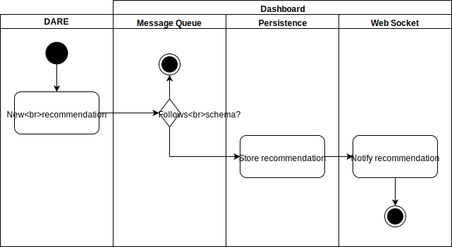
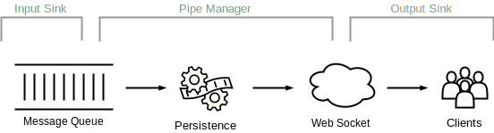

# Dashboard Queue

Provides a security policies message queue which DARE uses to convey security recommendations to the user. This queue accepts recommendations following the [Medium-level Security Policy Language (MSPL) XML schema](schema/mspl.xsd). The recommendations entering the queue are persisted and forwarded to the Dashboard GUI through a web socket so the user is notified of a new pending recommendation.

## Architecture

The Dashboard Queue functionality follows the analogy of a pipe which connects two ends. The rational is to have an agnostic pipe making use of input and output sinks and connecting them together. As long as the sinks follow the Observer design pattern the pipe doesn't actually care which concrete sink instantiation is provided upon instantiation.

The functionality is split into the following components, depicted in the diagram below:

* **Input Sink** is a security recommendations producer based on a message queue which registers itself as a producer in the pipe manager.
* **Pipe Manager** sets up the communication pipe between the input sink and the several output sinks. It also persists the security policies from the queue and notifies all the clients (output sinks) on new messages.
* **Output Sinks** registers itself as a security policies consumer so it gets notified of new recommendations.

## Implementation

The implementation makes use of the following modules:

**Input Sink**

* [dare_policy_q.py](dashboarddare/dare_policy_q.py) implements the security recommendations queue following the observable concept for an Observer design pattern in which any new message received in the queue triggers the notification of all the registered observers. During its instantiation it registers itself as an input sink in the communications pipe provided.

**Output Sinks**

* [dashboard_socket.py](dashboarddare/dashboard_socket.py) implements a web socket which only sends messages to its clients and ignores any message sent by a client. It follows the concrete observer concept for an Observer design pattern ensuring that every registered client receives the new security recommendation through the established socket. It supports multiple clients as it keeps a record of registered clients. During its instantiation it registers itself as an output sink in the communications pipe provided.

**Pipe Manager**

* [dare_policy_pipe.py](dare_policy_pipe.py) sets up the actual communications pipe used for the DARE-Dashboard security policies notifications. It simply defines the boot up procedures for the input and output sinks, does the internal plumbing to connect them, and ensures that the output sink consumes the events produced by the input sink. Then it relinquishes the control to the sinks letting them register as an input or output sink and all the magic happens.
