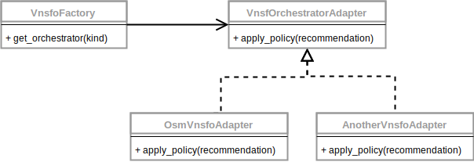

# Orchestrator Adapter

The Dashboard enlists the help of a vNSF Orchestrator to convey the security recommendations the user wants to apply. To decouple the Dashboard implementation from a specific Orchestrator an adapter is provided.

## Design

The Orchestrator Adapter makes use of the factory method pattern to instantiate the proper Orchestrator type. A common abstraction for the adapter is also defined so tailored implementations can be provided and thus multiple Orchestrators are supported. For the Dashboard to inteact with a new kind of Orchestrator it's as easy as defining a new adapter for said Orchestrator and add it to the factory, as presented next.

## Implementation

The implementation makes use of the following modules:

**Adapter**

* [vnsfo.py](vnsfo/vnsfo.py) defines the Orchestrator factory.
* [vnsfo_adapter.py](vnsfo/vnsfo_adapter.py) defines the adapter abstraction
* [osm_vnsfo.py](vnsfo/osm_vnsfo.py) implements the concrete adapter for an OSM Orchestrator resorting to its REST API.
