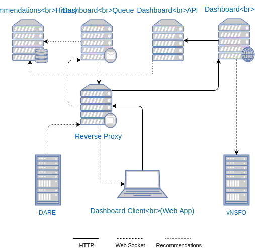

# Recommendations

Upon detecting network anomalies DARE notifies the Dashboard with the recommendations for network services (set of vNSFs) configuration to counter the ongoing anomalies. The configuration is a set of security policies to apply to the vNSFs.

The Dashboard persists these recommendations and presents them to the user through a visual notification when a recommendation is received (from DARE) and provides a web page where the user can list all the existing recommendations and apply the ones deemed fit for purpose.

The process of recommendation deployment is driven by the user. From the list of recommendations available the user can see the remediations proposed and choose which ones to deploy. The deployment triggers a request from the Dashboard to the Orchestrator which conveys the vNSFs configuration (defined by DARE) for the proposed remediation so it can be applied on the vNSFs and eventually solve a specific security threat.

## Architecture

The Dashboard security recommendations functionality is split into the following components:

* **Dashboard GUI** is a web application which provides the operational control centre for the user where all the visual notifications, information, and interactions takes place.
* **Dashboard API** handles the recommendations persistence and RESTful API so the GUI component can query the  existing recommendations and perform CRUD operations.
* **Dashboard Queue** takes care of the message queue assigned to the security recommendations ensuring its resilience and that the recommendations are conveyed to the GUI.
* **Recommendations History** is the records-keeping datastore for all the recommendations sent to the Dashboard.

## Deployment

The Dashboard security recommendations components are deployed as depicted in the infrastructure below.

Every element shown is a computational node with the folowing properties:

**Recommendations History**

* [Recommendations persistence implementation](../backend/persistence/README.md)
* [MongoDB](https://www.mongodb.com/) for the actual Recommendations data store.

**Dashboard Queue**

* [Recommendations queue implementation](../backend/dare/README.md)
* [RabbitMQ](http://www.rabbitmq.com/) for the messaging server

**Dashboard API**

* [Recommendations REST API](../backend/persistence/README.md)
* [Eve REST API framework](http://eve.readthedocs.io/en/stable/) providing [Flask](http://flask.pocoo.org/) for RESTful support and [Cerberus](http://python-cerberus.org/) for JSON validation

**Dashboard GUI**

* [Web application implementation](../frontend/README.md)
* [Node](https://nodejs.org/) for the HTTP server
* [AngularJS](https://angularjs.org/) for the web application framework

**Reverse Proxy**

* [HAProxy](http://www.haproxy.org/) to decouple Dashboard client from the internal deployment infrastructure and cope with scalability issues

# Further reading

Please refer to the [Dashboard Queue](../dare/README.md), the [Recommendations Persistence](../persistence/README.md), and the [Orchestrator Adapter](../vnsfo/README.md) for additional insight on the Dashboard logic.
